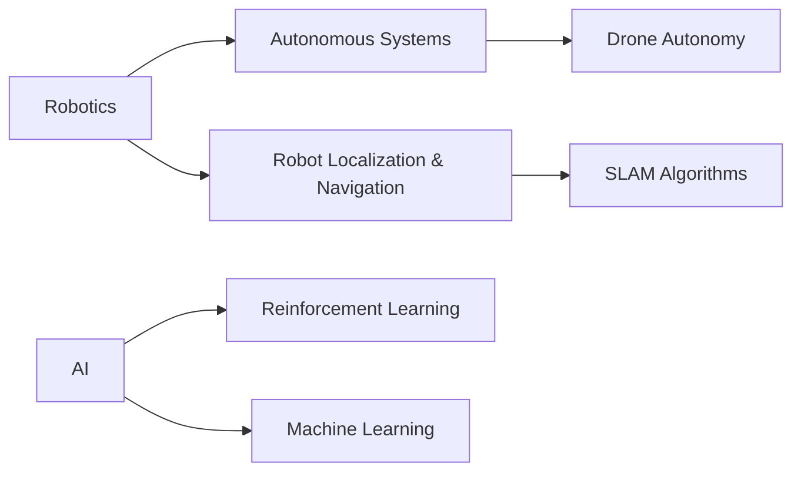

# 👋 Hello World! I'm HenryJin 

+----------------------------------------------------------------------------+
|  🎓 Undergraduate at BUPT in Telecommunication Engineering & Management   |
|  💻 Passionate Developer | 🤖 Robotics Enthusiast | 🚀 Future Innovator  |
+----------------------------------------------------------------------------+

## 🛠️ Tech Stack 
```python
def my_skills():
    languages = ["C/C++", "Python", "Java", "HTML"]
    embedded = ["STM32", "Arduino", "RTOS"]
    web_dev = ["Vue3", "JavaScript"]
    robotics = ["ROS", "SLAM", "Sensor Fusion"]
    return f"""
    print("⚙️ Embedded Systems: {embedded}")
    print("🕸️ Web Development: {web_dev}")
    print("🤖 Robotics Tools: {robotics}")
    """

my_skills()
```

## 🔭 Current Interests & Projects


## 🤖 Fun Robotics Fact
```c
#include <stdio.h>

int main() {
    printf("Did you know?\n");
    printf("The word 'robot' comes from the Czech word 'robota'\n");
    printf("meaning 'forced labor' or 'drudgery'!\n");
    return 0;
}
```

## 📫 How to Reach Me
Gmail: 1160375082@qq.com | jinhaoran419@gmail.com | jinhaoran@bupt.edu.cn (preferred)


[](https://github.com/anuraghazra/github-readme-stats)
[](https://github.com/anuraghazra/github-readme-stats)
<!---
jhr419/jhr419 is a ✨ special ✨ repository because its `README.md` (this file) appears on your GitHub profile.
You can click the Preview link to take a look at your changes.
--->

